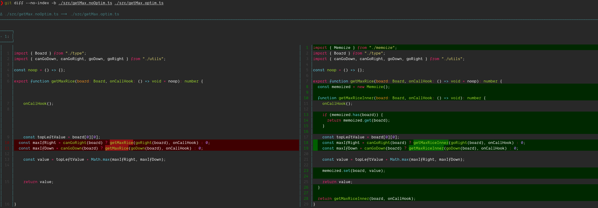

# Rice

The goal is to write an algorithm that simulate a mouse on a chess board.
The mouse can only go down and right.

The mouse start from the upper left and must reach the bottom right.

Some rice grain are on the board.
The mouse want to know how many rice grain can be collected at maximum.

The exact path is not interesting.

## Get started

```bash
yarn test
```

## Optimization

To keep the complexity under control, lets introduce a few optimizations.

- memoization


